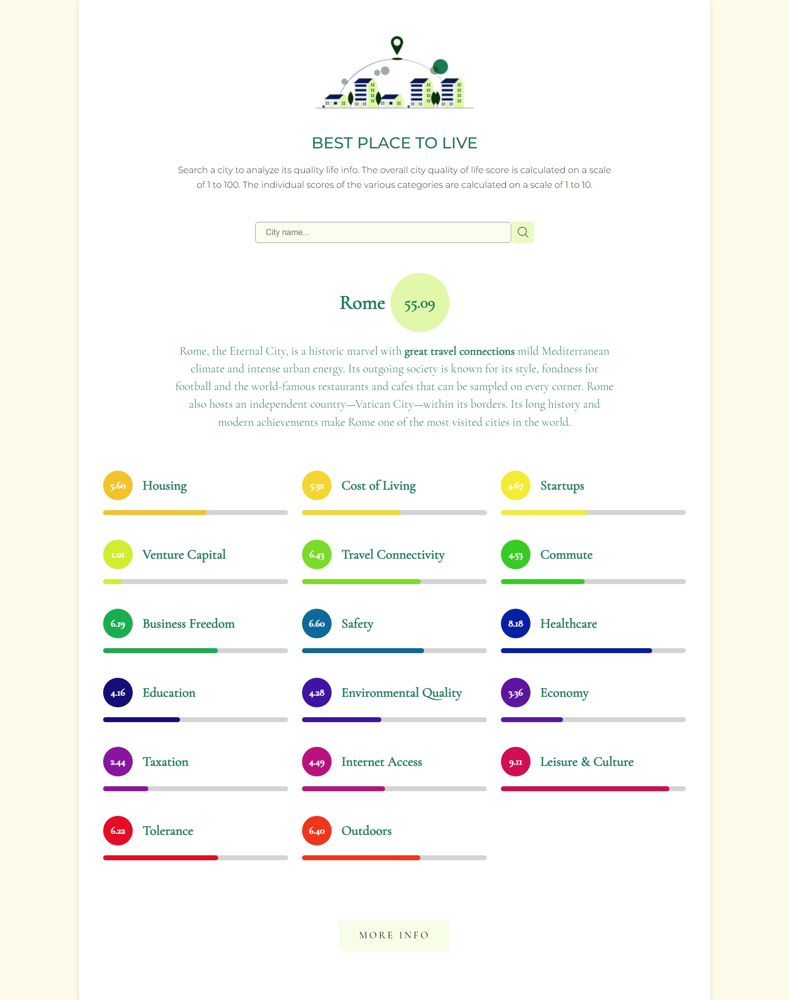

<p align="center">
  <a href="https://github.com/Auro-93/life-quality-app">
    
  </a>

  <h3 align="center">Life Quality App</h3>

  <p align="center">
    Search a city name and discover its life quality indicators
  </p>
</p>

<details open="open">
  <summary><h2 style="display: inline-block">Table of Contents</h2></summary>
  <ol>
    <li>
      <a href="#about-the-project">About The Project</a>
      <ul>
        <li><a href="#built-with">Built With</a></li>
      </ul>
    </li>
    <li>
      <a href="#getting-started">Getting Started</a>
      <ul>
        <li><a href="#prerequisites">Prerequisites</a></li>
        <li><a href="#installation">Installation</a></li>
      </ul>
    </li>
    <li><a href="#usage">Usage</a></li>
    <li><a href="#license">License</a></li>
    <li><a href="#links-contacts">Links & Contacts</a></li>
    <li><a href="#acknowledgements">Acknowledgements</a></li>
  </ol>
</details>

## About The Project



This is a a simple vanilla Javascript web app that fetches cities life quality data from the [Teleport](https://developers.teleport.org/api/getting_started/) free API. and displays them.

The user can discover info about its preferred city via search input.

Statistics include the total score of the city, a brief description of it and the partial scores of various indicators such as: housing, cost of living, startups, venture capital, travel connectivity, commute, business freedom, safety, healthcare, education, environmental quality, economy, taxation, internet access, leisure & culture, tolerance and outdoors.

### Built With

- [Javascript](https://developer.mozilla.org/en-US/docs/Web/JavaScript?retiredLocale=it)
- [Webpack 5](https://webpack.js.org/blog/2020-10-10-webpack-5-release/)
- [Babel](https://babeljs.io/setup#installation)
- [Lodash](https://lodash.com/)
- [Axios](https://github.com/axios/axios)
- [Animate CSS](https://animate.style/)

## Getting Started

### Prerequisites

Running the application requires [Node](https://nodejs.org/en/) to be installed on your operating system.

You can then install the latest version of npm from your terminal with the command:

```sh
npm install npm@latest -g
```

### Installation

1. Clone the repository locally with the git command:

   ```sh
   git clone https://github.com/Auro-93/life-quality-app.git
   ```

2. Install NPM packages:

   ```sh
   npm install
   ```

3. Build from source:

   ```sh
   npm run build
   ```

4. Open dist/index.html

## Usage

The user can type a city of his choice via search input. When the form is submitted, a get axios request to the Teleport API fetches the data
of the city. These life quality data are then displayed in the interface.

## License

Distributed under the MIT License. See `LICENSE` for more information.

## Links & Contacts

[@Aurora Sirigu](https://www.linkedin.com/in/aurora-sirigu-a001301b4/) - 93a.sirigu at gmail dot com

Project Repository: [Life Quality App](https://github.com/Auro-93/life-quality-app)

Project Website: [Life Quality App - Netlify](https://life-quality-app.netlify.app/)

Portfolio: [aurodev-web-developer-portfolio](https://aurodev-web-developer-portfolio.netlify.app/)

## Acknowledgements

- [Best-README-Template](https://github.com/othneildrew/Best-README-Template)
- [Awesome README](https://github.com/matiassingers/awesome-readme)
- [Teleport API](https://developers.teleport.org/api/getting_started/)
- [Webpack 5 guide](https://www.taniarascia.com/how-to-use-webpack/)
